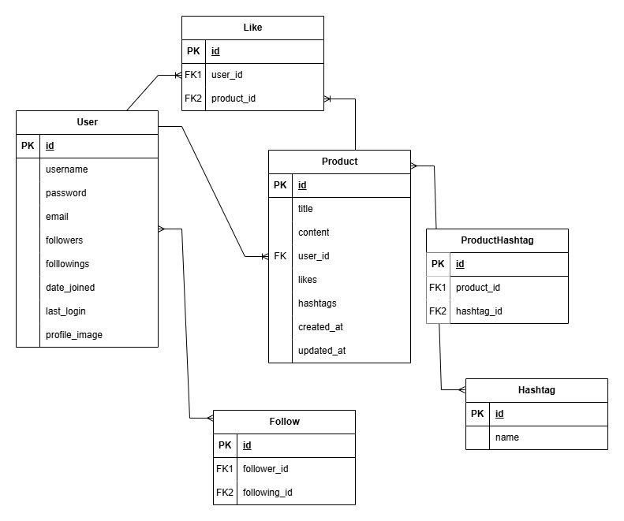

# 스파르타마켓 (Sparta Market)
스파르타마켓은 Django 프레임워크를 기반으로 개발된 중고거래 플랫폼입니다. 사용자 친화적인 인터페이스와 다양한 기능을 통해 사용자들이 간편하게 물품을 등록하고 거래할 수 있도록 설계되었습니다.   

---

## 주요 기능
### 사용자 관리
- 회원가입, 로그인, 로그아웃 기능 제공
- 사용자 프로필 관리(정보 수정 및 계정 삭제 포함)
### 물품 관리
- 물품 등록, 수정, 삭제, 조회 등 CRUD 기능 지원
- 물품에 제목, 설명, 가격, 이미지 등을 추가 가능
- 찜하기 기능을 통해 관심 물품 등록
### 검색 및 정렬
- 제목, 내용, 작성자, 해시태그 기반 검색 기능 제공
- 최신순 및 인기순 정렬 기능으로 유연한 조회 가능
### 상호작용 기능
- 팔로우 및 팔로워 시스템을 통해 사용자 간 네트워크 형성
---

## 설치 및 실행방법
### 필수 조건
- Python 3.8 이상
- pip (Python 패키지 관리자)
- 가상환경 도구(선택 사항)

### 단계별 가이드
1. 저장소 클론
``` bash 
git clone https://github.com/guitter1/spartamarket.git
cd spartamarket
```

2. 가상환경 설정(선택사항)
``` bash
python -m venv venv
source venv/bin/activate  # Windows: venv\Scripts\activate
```

3. 필요 패키지 설치
``` bash
pip install -r requirements.txt
```

4. 데이터 마이그레이션
``` bash
python manage.py migrate
```

5. 서버 실행
``` bash
python manage.py runserver
```

6. 웹브라우저에서 확인
http://127.0.0.1:8000/으로 접속

---
## ERD



---


## 프로젝트 구조
```
spartamarket/
│
├── accounts/         # 사용자 인증 및 프로필 관리 관련 앱
├── products/         # 물품 관리와 관련된 앱
├── config/           # 프로젝트 전역 설정 및 구성 파일
├── templates/        # HTML 템플릿 파일
├── media/           # 정적 파일 (CSS, JavaScript, 이미지 등)
├── manage.py         # Django 명령어 관리 도구
├── requirements.txt  # 프로젝트 필수 패키지 목록
└── README.md         # 프로젝트 설명 문서
```

## 트러블슈팅
<details><summary>정렬기능 사용 시 게시글 중복형성</summary>
  products>views.py
  기존코드:
  ```
  def products(request):
    products = Product.objects.all()
    product_count = products.count()
    form = OrderForm(request.GET)

    if form.is_valid(): 
        category_option = form.cleaned_data.get('category', 'pk')  
    else:
        category_option = 'pk'  

    # 정렬 조건 처리 
    if category_option == 'views':
        products = products.order_by('-views', '-like_users')
    elif category_option == 'like_users':
        products = products.order_by('-like_users', '-views')
    elif category_option == 'pk':
        products = products.order_by('-pk')

    context = {"products": products, "product_count": product_count, "form": form}
    return render(request, "products/products.html", context)

  ```
  수정코드:
  ```
  def products(request):
    products = Product.objects.annotate(like_count=Count('like_users'))  # annotate로 like 수 계산
    product_count = products.count()
    form = OrderForm(request.GET)

    if form.is_valid():
        category_option = form.cleaned_data.get('category', 'pk')
    else:
        category_option = 'pk'

    # 정렬 조건 처리
    if category_option == 'views':
        products = products.order_by('-views', '-like_count') 
    elif category_option == 'like_users':
        products = products.order_by('-like_count', '-views')  
    elif category_option == 'pk':
        products = products.order_by('-pk')  

    context = {"products": products, "product_count": product_count, "form": form}
    return render(request, "products/products.html", context)
  ```

</details>


<details><summary>게시글 수정, 삭제 권한 확인</summary>
  products>views.py
  기존코드:
  ```
  @login_required
  def edit(request, pk):
    product = get_object_or_404(Product, pk=pk)
    if product.author != request.user:
        return HttpResponseForbidden("작성자만 수정할 수 있습니다.")
    if request.method == "POST":
        form = ProductForm(request.POST, request.FILES, instance=product)
        if form.is_valid():
            form.save()
            return redirect("products:product_detail", product.pk)
    else:
        form = ProductForm(instance=product)
    return render(request, "products/edit.html", {"form": form})
  ```
  문제점: 기존에 있던 그리고 앞으로 추가될 모든 수정, 삭제 코드에 저런 로직을 새로 추가해줘야 하는 문제(DRY)
  해결방법: utils.py에 데코레이터를 만들어 저장하고 데코레이터만 import하여 사용

  utils.py
  ```
  from functools import wraps
  from django.http import HttpResponseForbidden
  from django.shortcuts import get_object_or_404

  def author_required(model, lookup_field="pk"):
    def decorator(view_func):
        @wraps(view_func)
        def _wrapped_view(request, *args, **kwargs):
            obj = get_object_or_404(model, **{lookup_field: kwargs[lookup_field]})
            if obj.author != request.user:
                return HttpResponseForbidden("작성자만 접근할 수 있습니다.")
            return view_func(request, *args, **kwargs)
        return _wrapped_view
    return decorator
  ```
  views.py
  ```
  from .models import Product, Comment
  from .utils import author_required

  @login_required
  @author_required(Product)
  def edit(request, pk):
    product = get_object_or_404(Product, pk=pk)
    if request.method == "POST":
        form = ProductForm(request.POST, request.FILES, instance=product)
        if form.is_valid():
            form.save()
            return redirect("products:product_detail", product.pk)
    else:
        form = ProductForm(instance=product)
    return render(request, "products/edit.html", {"form": form})
  ```
</details>

