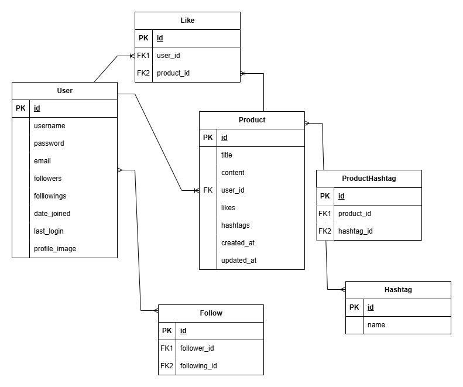

# 스파르타마켓 (Sparta Market)
스파르타마켓은 Django 프레임워크를 기반으로 개발된 중고거래 플랫폼입니다. 사용자 친화적인 인터페이스와 다양한 기능을 통해 사용자들이 간편하게 물품을 등록하고 거래할 수 있도록 설계되었습니다.   

---

## 주요 기능
### 사용자 관리
- 회원가입, 로그인, 로그아웃 기능 제공
- 사용자 프로필 관리(정보 수정 및 계정 삭제 포함)
### 물품 관리
- 물품 등록, 수정, 삭제, 조회 등 CRUD 기능 지원
- 물품에 제목, 설명, 가격, 이미지 등을 추가 가능
- 찜하기 기능을 통해 관심 물품 등록
### 검색 및 정렬
- 제목, 내용, 작성자, 해시태그 기반 검색 기능 제공
- 최신순 및 인기순 정렬 기능으로 유연한 조회 가능
### 상호작용 기능
- 팔로우 및 팔로워 시스템을 통해 사용자 간 네트워크 형성
---

## 설치 및 실행방법
### 필수 조건
- Python 3.8 이상
- pip (Python 패키지 관리자)
- 가상환경 도구(선택 사항)

### 단계별 가이드
1. 저장소 클론
``` bash 
git clone https://github.com/guitter1/spartamarket.git
cd spartamarket
```

2. 가상환경 설정(선택사항)
``` bash
python -m venv venv
source venv/bin/activate  # Windows: venv\Scripts\activate
```

3. 필요 패키지 설치
``` bash
pip install -r requirements.txt
```

4. 데이터 마이그레이션
``` bash
python manage.py migrate
```

5. 서버 실행
``` bash
python manage.py runserver
```

6. 웹브라우저에서 확인
http://127.0.0.1:8000/으로 접속

---
## ERD



---


## 프로젝트 구조
```
spartamarket/
│
├── accounts/         # 사용자 인증 및 프로필 관리 관련 앱
├── products/         # 물품 관리와 관련된 앱
├── config/           # 프로젝트 전역 설정 및 구성 파일
├── templates/        # HTML 템플릿 파일
├── media/           # 정적 파일 (CSS, JavaScript, 이미지 등)
├── manage.py         # Django 명령어 관리 도구
├── requirements.txt  # 프로젝트 필수 패키지 목록
└── README.md         # 프로젝트 설명 문서
```


